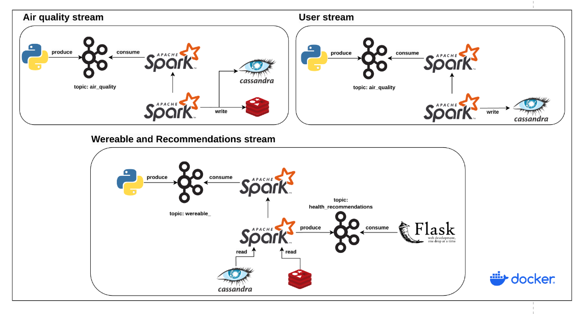
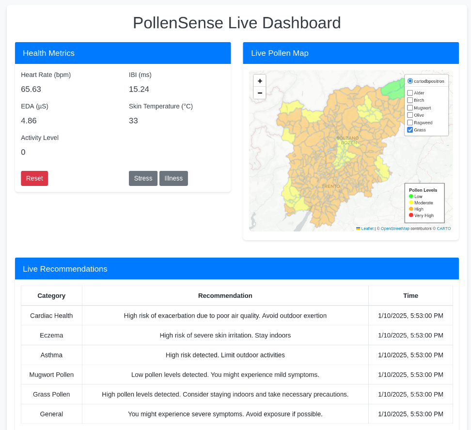

# PollenSense: A Data-Driven System for Personalized Allergy Recommendations

##  Abstract

This repository contains the source code and documentation for the 'PollenSense project, part of the course of Big Data Technologes at the University of Trento. The primary goal of the project is to provide real-time health recommendations to individuals affected by pollen allergies. By leveraging data from diverse sources such as meteorological APIs, wearable health devices, and user-reported symptoms and conditions, this system offers personalized advice to minimize allergen exposure and improve quality of life.

## Technologies

-   **Data Ingestion and Streaming:**
    -   Apache Kafka: Real-time data streaming from environmental sensors and APIs.
    -   RESTful APIs: Integration with external weather and pollen services.
-   **Data Storage and Management:**
    -   Apache Cassandra: Distributed NoSQL database for managing large-scale, structured, and semi-structured data with high availability.
    -   Redis: In-memory data store used for caching and fast access to frequently queried information.
-   **Data Processing and Analytics:**
    -   Apache Spark: Distributed data processing for high-velocity data streams.
-   **Synthetica data generation:**
    -   CTGAN (Conditional Tabular Generative Adversarial Network): Generates synthetic tabular data.
-   **Deployment:**
    -   Docker: Containerization and orchestration of the system's microservices.
-   **User Interface and Notifications:**
    -   Flask & Bootstrap: Web-based user dashboards.

## Architecture




##  How to run

The core application is containerized and managed using Docker for easy setup and deployment. Please Follow these steps to run the application:

1.  **Install Docker:**  
    Ensure Docker is installed on your system. You can download and install Docker from [Docker's official website](https://www.docker.com/).
    
2.  **Clone the Repository:**  
    Clone this GitHub repository to your local machine:
    
    ```bash
    git clone https://github.com/mattia-rampazzo/bdt_project.git
    cd bdt_project
    ```
    
3.  **Build the Docker Images:**  
    Build the required Docker images using the provided `Dockerfile` and `docker-compose.yml`:
    
    ```bash
    docker compose build
    ```
    
4.  **Start the Application:**  
    Start the entire application stack (including all services like Kafka, Cassandra, Redis, Flask, and Spark) using Docker Compose:
    
    ```bash
    docker compose up -d
    
    ```
    
5.  **Access the Dashboard:**  
    Once the application is running, you can access the dashboard by navigating with your preferred browser to:
    
    ```
    http://localhost:5000
    ```
    
6.  **Stop the Application:**  
    To stop the application run:
    
    ```bash
    docker compose down
 
    ```

## Project Structure 

A summary of the project structure and the main files is reported below:

`setup.py`:  Script that initializes the system.

### air_quality   
 -   `air_quality_fetch.py`: Script to fetch pollen and weather data and write it to Kafka.
 
### dashboard   
 -   `app.py`: The main Flask application file that runs the dashboard and handles server-side logic.
    -   `utils`: A directory containing two Python utility files:
		-   One for generating the live map representation.
		-   Another for simulating data from a wearable device.
    -   `templates`: Contains HTML templates for the dashboard.
    -   `data`: Contains GeoJSON data used for rendering geographic information on the map.

### data
 -   `Trentino-AltoAdige_municipalities.csv`: A CSV file containing updated data as of 2024, including ISTAT codes, municipality names, latitude, and longitude information for the municipalities in the Trentino-Alto Adige region.
 -   `Users_synthetic_dataset.csv`: A CSV file containing anonymized synthetic data including personal informations, medical conditions and pollen allergies.

### services
 -   `cassandra_client.py`: Manages communications with the Cassandra database.
 -   `kafka_client.py`: Manages interaction with Kafka.
 -   `redis_client.py`: Manages communications with the Redis database.

### spark_streaming
 -   `air_quality_stream.py`: Ingests real-time air quality data streams and writes to both Cassandra (for long-term storage) and Redis (for fast access and caching).
 -   `users_stream.py`:  Ingests and stores to Cassandra data about new users of the system.
 -   `recommendations_stream.py`:  Analyzes incoming data streams to generate real-time personalized health recommendations for users based on environmental and wearable data.

### user_generator
 -   `BGTOriginalDatasetBuilder_2_0.ipynb`: A notebook showing the procedure followed to build the CTGAN model to create synthetic user data.
 -   `CAD.csv`:  A CSV file for Cardiovascular disease analysis.
 -   `asthma_disease_data.csv`:  A CSV file for asthm analysis.
 -   `user_generation.py`:  Script that send new user to the system.


## Results




# Predictions Folder

The `Predictions` folder, though not yet integrated with the core functionalities and the interface, serves as a foundation for future enhancements to the project. It showcases a solid, although not yet perfect, prediction system designed to empower users with insights into pollen levels. Once integrated, this system will enable users to make informed decisions, take proactive measures to manage their allergies, and plan their daily activities with greater confidence and protection. Below is a brief explanation of the contents of this folder:

### Folder Contents

1. **`Merged_Valleys_and_Municipalities.csv`**  
   This file contains the coordinates of most municipalities in the region, along with the valleys they are associated with. The dataset was built by integrating data from a geojson file ([source here](https://github.com/openpolis/geojson-italy/blob/5dd489e676158175c75ae452ab9ec449bf5efb4b/geojson/limits_IT_municipalities.geojson)) and additional data gathered via ChatGPT and online sources. While it does not cover all municipalities and valleys, it is sufficient for creating a structured model that includes the region's major valleys for reliable data gathering and predictions.

2. **`Valley_Boundaries.csv`**  
   This file defines the boundaries of each selected valley by constructing perimeters based on the municipalities within them. The area enclosed within these perimeters represents the corresponding valley's boundary.

3. **`config.json`**  
   A configuration file allowing users to launch simulations. It includes details such as:
   - The latitude and longitude for the region's focal point.
   - Types of pollen being monitored (e.g., Birch, Grass, Olive).
   - The specific pollen type selected for prediction.

4. **`daily_data.csv`**  
   A dataset containing simulation results for testing purposes. It includes daily pollen levels as captured or simulated during the project.

5. **`model.ipynb`**  
   A Jupyter Notebook that generates predictive models for pollen levels in each valley using the data collected. This is a key component in building accurate forecasts.

6. **`predictions.ipynb`**  
   Another Jupyter Notebook designed to enable users to visualize and analyze prediction results. Proper execution of this notebook provides insights into pollen levels across the region.


### How to Run

To generate predictions for today's and tomorrow's pollen levels in the Trentino-Alto Adige region, follow these steps:

1. **Configure Parameters**  
   Open the `config.json` file and insert your preferred settings:
   - Specify the **latitude** and **longitude** of the desired location.
   - Choose the pollen types to include and set the **selected_pollen** parameter to your preferred pollen type.

2. **Run the Prediction Notebook**  
   Open the `predictions.ipynb` file and follow the steps outlined in the notebook.

3. **Analyze Results**  
   The output will display predictions for the desired location pollen levels, allowing for visualization and interpretation of the data.

---


## Authors

This project was developed by group 13, consisting of:

- [Mattia Rampazzo](https://github.com/mattia-rampazzo)
- [Davide Giordani](https://github.com/DavideGiordani11)
- [Tommaso Grotto](https://github.com/TommasoGrotto2)
